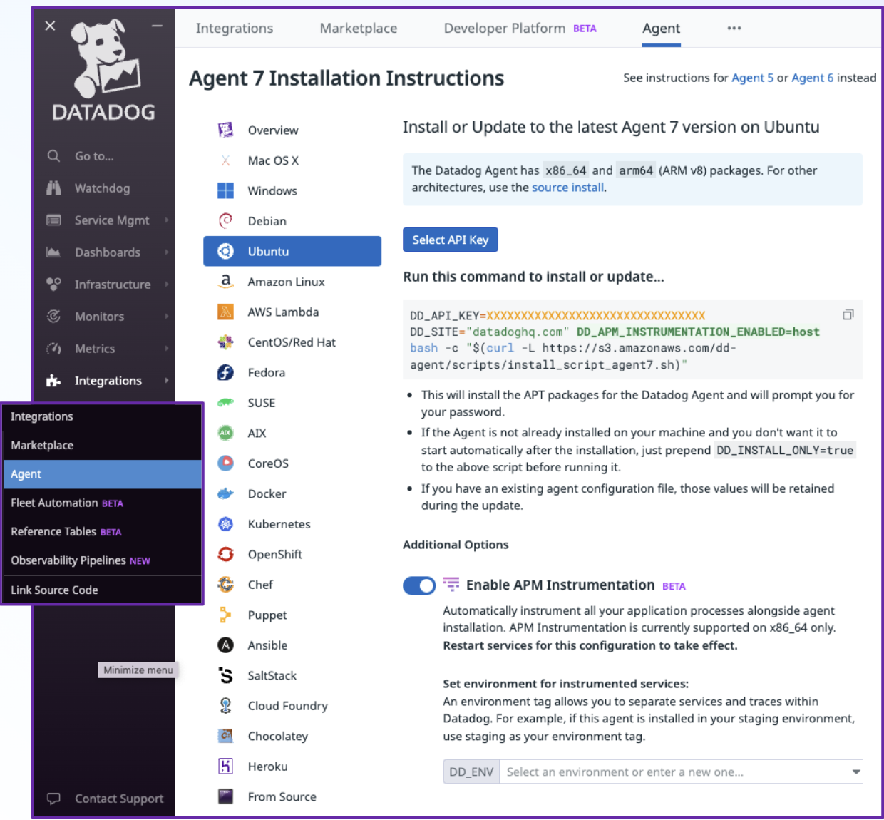
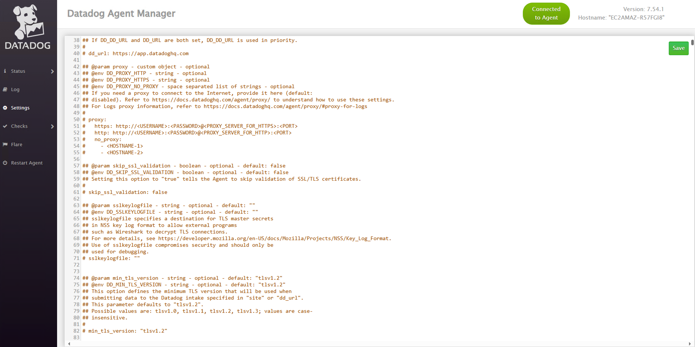

# Datadog Quick Start Guide
本リポでは、様々な環境におけるDatadogモニターリング用のAgentの設定ファイルのテンプレートをご用意して、Datadogによる監視をすぐに始められるガイドになります。
迅速にAgentのセットアップを完了するために、以下の詳細なステップをご確認、お願い致します。

また、もし設定上より詳細な内容やAgentのコマンドをご確認されたい場合は以下のオフィシャルドキュメントにてご参照お願いします。  
&nbsp;&nbsp;&nbsp;Agentの使い方：<[https://docs.datadoghq.com/ja/agent/](https://docs.datadoghq.com/ja/agent/basic_agent_usage/?tab=Linux)>

## Windows
※注意点として、DatadogのコンフィグファイルはすべてエンコードがUTF-8であり、エンコードUTF-8を指定した上で編集するようにお願いします。
1. WindowsサーバにAgentをインストール後、[datadog/Host Based/Windows/](https://github.com/kennethfoo24/datadog/tree/main/Host%20Based/Windows)配下すべてのファイルをDatadogフォルダ(%ProgramData%\Datadog\)にコピーし上書き保存
2. %ProgramData%\Datadog\datadog.yaml を編集し、<API_KEY>のところにDatadogのAPI Keyで入れ替えて保存。Windowsの場合はGUI操作からDatadogの設定ファイルの変更も可能なので、Datadog Agent Managerから（アプリケーション）を開き、Settingsタブをクリックすると設定内容を確認できます。

3. 設定変更後、右上のSaveボタンを押した後に、Restart Agentボタンを押して、Agentを再起動します。

4. Datadog Agent ManagerのUIから、Statusタブから、Agentのステータスを確認し、エラーがなかれば設定完了

## Linux 
1. LinuxサーバにAgentをインストール後、datadog/Host Based/Linux配下すべてのファイルをDatadogディレクトリ(/etc/datadog-agent/)にコピーし上書き保存  
2. /etc/datadog-agent/datadog.yaml を編集し、<API_KEY>のところにDatadogのAPI keyで入れ替えて保存    
3. 以下コマンドでAgentを再起動      
&nbsp;&nbsp;&nbsp;Centos/Redhat/Amazon linxu: `sudo systemctl restart datadog-agent`  
&nbsp;&nbsp;&nbsp;Ubuntu/Debian: `sudo service datadog-agent restart`  
4. 以下コマンドでAgentのステータスを確認し、エラーがなかれば設定完了  
&nbsp;&nbsp;&nbsp;`sudo datadog-agent status`  
